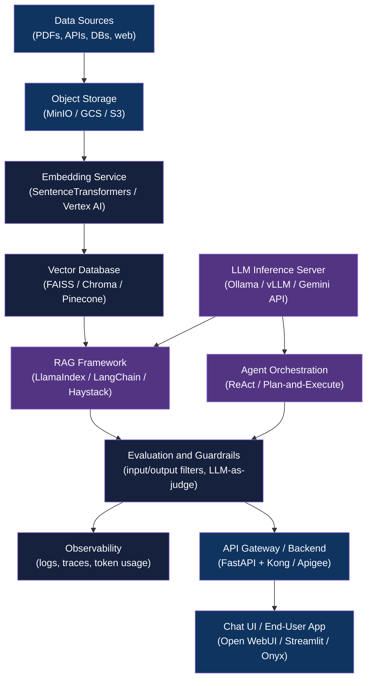

<div align="center">

# AI System Architecture Landscape

[](https://www.python.org/downloads/)
[](LICENSE)

**Principal-level reference architecture for modern AI systems across local, hybrid, and GCP-native deployments**

[Getting Started](#getting-started) | [Usage](#usage) | [Architecture](#architecture)

</div>

---

## Table of Contents

- [The Problem](#the-problem)
- [Features](#features)
- [Tech Stack](#tech-stack)
- [Architecture](#architecture)
- [Getting Started](#getting-started)
  - [Prerequisites](#prerequisites)
  - [Installation](#installation)
- [Usage](#usage)
- [Landscape Reference](#landscape-reference)
  - [1. Data Sources and Ingestion](#1-data-sources-and-ingestion)
  - [2. Data Storage and Object Stores](#2-data-storage-and-object-stores)
  - [3. Structured Databases](#3-structured-databases)
  - [4. Vector Databases and Search](#4-vector-databases-and-search)
  - [5. Embedding Models and Services](#5-embedding-models-and-services)
  - [6. LLM Inference and Model Serving](#6-llm-inference-and-model-serving)
  - [7. RAG Frameworks and Context Assembly](#7-rag-frameworks-and-context-assembly)
  - [8. Agent and Orchestration Frameworks](#8-agent-and-orchestration-frameworks)
  - [9. Workflow Automation and Integration Platforms](#9-workflow-automation-and-integration-platforms)
  - [10. Evaluation, Guardrails, and Safety](#10-evaluation-guardrails-and-safety)
  - [11. Observability, Logging, and Monitoring](#11-observability-logging-and-monitoring)
  - [12. API Gateways and Backend Services](#12-api-gateways-and-backend-services)
  - [13. Chat, UI, and End-User Applications](#13-chat-ui-and-end-user-applications)
  - [14. Coding and Developer Productivity Tools](#14-coding-and-developer-productivity-tools)
  - [15. Deployment, Runtime, and Infrastructure](#15-deployment-runtime-and-infrastructure)
- [Appendix](#appendix)
- [Architectural Decisions](#architectural-decisions)
- [Project Structure](#project-structure)
- [License](#license)
- [Author](#author)

## The Problem

### Fragmented AI stack knowledge

Modern AI systems span 15+ component categories (ingestion, vector search, embedding, inference, orchestration, observability, and more), each with 3-8 viable tool options. Choosing a stack without a cross-layer view leads to incompatible choices, missed trade-offs, and costly re-architecture.

### The Solution

This landscape maps every layer of a production-grade AI system with tool comparisons, selection criteria, and layer dependency charts. Three deployment variants (local parity, hybrid GCP, full GCP-native) let practitioners match stack choices to their scale and cost constraints from day one.

## Features

- **15-category layer taxonomy** - covers every component from raw data ingestion through end-user UI, with architectural role and interaction model per layer
- **Tool comparison tables** - head-to-head on abstraction level, composability, and deployment mode for vector databases, embedding models, LLM servers, RAG frameworks, and more
- **Three deployment variants** - local parity (Ollama + ChromaDB + MinIO), hybrid GCP (Cloud Run + open-source models), and full GCP-native (Vertex AI Gemini + Vector Search) with migration paths between them
- **Layer dependency matrix** - maps which layers feed which, so you can reason about blast radius before choosing tools
- **OpenAI-compatible API contract** - articulates the interface boundary that enables provider switching without application rewrites
- **Minimal viable stack recommendation** - Ollama + SentenceTransformers + FAISS/Chroma + LlamaIndex + FastAPI + Open WebUI for most enterprise knowledge use cases

## Tech Stack

| Component | Technology |
|-----------|------------|
| Language | Python 3.12+ |
| Runtime packaging | pyproject.toml (uv / pip) |
| Reference variants | Local (Ollama, ChromaDB, MinIO), Hybrid GCP (Cloud Run, vLLM, FAISS), Full GCP-native (Vertex AI, Cloud Storage, Gemini) |

## Architecture

The diagram below shows the canonical data and control flow across all 15 landscape layers. The landscape documents detail tool options at each node.



Three deployment variants are documented in `docs/`:

| Variant | Best For | Trade-offs |
|---------|----------|------------|
| [Local Parity](docs/architecture-local-parity.md) | Development, demos, privacy-sensitive workloads | Single-user, no HA, hardware-limited |
| [Hybrid GCP](docs/architecture-hybrid.md) | Cost-conscious production MVPs | Some ops overhead, medium scale |
| [Full GCP-Native](docs/architecture-gcp-native.md) | Enterprise production, regulated industries | Higher cost, maximum scale and reliability |

## Getting Started

### Prerequisites

- Python 3.12+
- No additional runtime dependencies (reference repo)

### Installation

1. Clone the repository:
   ```bash
   git clone https://github.com/adityonugrohoid/ai-system-architecture-landscape.git
   cd ai-system-architecture-landscape
   ```

2. Optional: set up a virtual environment to run `main.py`:
   ```bash
   python -m venv .venv
   source .venv/bin/activate
   ```

## Usage

Browse the landscape reference below, or open the deployment variant docs in `docs/` for per-architecture implementation guides.

To run the placeholder entry point:

```bash
python main.py
```

Expected output:

```
Hello from ai-system-architecture-landscape!
```

## Landscape Reference

### 1. Data Sources and Ingestion

**Architectural role:** Entry point for all information processed, embedded, or retrieved by the AI system. Handles extraction, transformation, and normalization into processable formats.

**Layer characteristics:**

| Aspect | Value |
|--------|-------|
| Required | Mandatory for RAG; optional for pure chat |
| State | Stateless (processing) or event-driven (streaming) |
| Feeds into | Storage layer, embedding services |

**Common source types:**

| Source type | Examples |
|-------------|----------|
| Documents | PDF, DOCX, Markdown, HTML |
| Structured | SQL databases, CSV, JSON |
| Unstructured | Images, audio transcripts |
| Real-time | APIs, webhooks, message queues |
| Web | Scraped content, RSS feeds |

**Processing stages:** extraction -> cleaning -> chunking -> metadata enrichment

### 2. Data Storage and Object Stores

**Architectural role:** Persistent storage for raw documents, processed artifacts, model weights, and system assets.

**Layer characteristics:**

| Aspect | Value |
|--------|-------|
| Required | Mandatory |
| State | Stateful (persistent) |
| Feeds into | Embedding, retrieval layers |

**Tool comparison:**

| Tool | Deployment | Abstraction |
|------|------------|-------------|
| MinIO | Local / Hybrid | Low - S3-compatible, self-hosted |
| AWS S3 | Cloud (AWS) | Mid - managed, lifecycle policies |
| Google Cloud Storage | Cloud (GCP) | Mid - strong consistency, GCP-native |

**Selection criteria:**
- Local development: MinIO (S3-compatible, no cloud dependency)
- GCP production: Cloud Storage (native integration, managed)
- Hybrid: MinIO locally, cloud storage in production

### 3. Structured Databases

**Architectural role:** ACID-compliant storage for user accounts, session state, document metadata, audit logs, and application configuration.

**Layer characteristics:**

| Aspect | Value |
|--------|-------|
| Required | Situational |
| State | Stateful (persistent, transactional) |
| Accessed by | Backend services, orchestration layer |

**Typical choices:**
- PostgreSQL - full-featured, open-source, supports pgvector extension
- SQLite - embedded, zero-config, suitable for local development
- Cloud SQL / RDS - managed relational databases for production

### 4. Vector Databases and Search

**Architectural role:** Stores and indexes vector embeddings for similarity search. The core retrieval layer for RAG systems.

**Layer characteristics:**

| Aspect | Value |
|--------|-------|
| Required | Mandatory for RAG |
| State | Stateful (persistent index) |
| Feeds into | RAG / orchestration layer |

**Tool comparison:**

| Tool | Type | Abstraction | Composability |
|------|------|-------------|---------------|
| FAISS | Library | Low | Composable |
| Chroma | DB | Mid | Composable |
| Milvus | DB (distributed) | Mid | Opinionated |
| Weaviate | DB (GraphQL + ML modules) | High | Opinionated |
| Pinecone | Managed | High | Opinionated |

**Selection criteria:**

| Scenario | Recommended |
|----------|-------------|
| Local development, small datasets | Chroma, FAISS |
| Production, self-managed | Milvus, Weaviate |
| Production, managed | Pinecone, Vertex AI Vector Search |
| Hybrid (cloud infra, open-source) | FAISS on Cloud Run |

### 5. Embedding Models and Services

**Architectural role:** Converts text (or other modalities) into dense vector representations for semantic search.

**Layer characteristics:**

| Aspect | Value |
|--------|-------|
| Required | Mandatory for RAG and semantic search |
| State | Stateless (inference only) |
| Outputs to | Vector DB |

**Tool comparison:**

| Tool | Deployment | Abstraction |
|------|------------|-------------|
| SentenceTransformers | Local / self-hosted | Low - fine-tunable, open source |
| BGE (BAAI General Embedding) | Local / self-hosted | Low - multilingual, multiple sizes |
| OpenAI Embeddings (text-embedding-3) | Managed API | High - pay-per-token |
| Vertex AI Embeddings | Managed (GCP) | High - multiple model variants |

**Key constraints:**
- Embedding dimensions must match across ingestion and query time
- Changing embedding models requires re-indexing all documents
- Self-hosted models benefit from GPU for batch processing

### 6. LLM Inference and Model Serving

**Architectural role:** The generative core. Executes language model inference and abstracts model loading, batching, and hardware management from application code.

**Critical pattern:** LLMs are deployed as long-running inference servers, not loaded per request. Models load into GPU memory at container startup and serve multiple requests via HTTP.

**Layer characteristics:**

| Aspect | Value |
|--------|-------|
| Required | Mandatory |
| State | Long-running (model in memory) |
| Receives from | Orchestration layer |

**Self-hosted tool comparison:**

| Tool | Deployment | Abstraction | Composability |
|------|------------|-------------|---------------|
| Ollama | Local | High | Opinionated |
| vLLM | Self-hosted | Low - PagedAttention, high throughput | Composable |
| Hugging Face TGI | Self-hosted | Mid - Docker-native | Composable |
| llama.cpp | Local | Low - GGUF, minimal deps | Composable |

**Managed alternatives:**

| Platform | Provider |
|----------|----------|
| Vertex AI (Gemini) | GCP |
| AWS Bedrock (Claude, Titan, Llama) | AWS |
| Azure AI Studio | Azure |

**OpenAI-compatible API endpoints** (all self-hosted servers should expose):

| Endpoint | Method | Purpose |
|----------|--------|---------|
| `/v1/chat/completions` | POST | Chat-based generation |
| `/v1/completions` | POST | Text completion |
| `/v1/models` | GET | List available models |

### 7. RAG Frameworks and Context Assembly

**Architectural role:** Orchestrates the retrieval-augmented generation pipeline: query processing, context retrieval, prompt construction, and response generation.

**Layer characteristics:**

| Aspect | Value |
|--------|-------|
| Required | Mandatory for RAG; optional for simple chat |
| State | Stateless (per-request processing) |
| Coordinates | Vector DB, LLM, embedding services |

**Tool comparison:**

| Tool | Abstraction | Composability |
|------|-------------|---------------|
| LangChain | High - chains, agents, integrations | Opinionated |
| LlamaIndex | High - strong document processing | Opinionated |
| Haystack | Mid - pipeline-based component model | Composable |
| AnythingLLM | High - all-in-one with built-in UI | Opinionated |

**Selection guidance:**

| Scenario | Recommended |
|----------|-------------|
| Rapid prototyping | LangChain, AnythingLLM |
| Document-heavy applications | LlamaIndex |
| Production pipelines | Haystack, custom implementation |
| Maximum control | Custom RAG implementation |

### 8. Agent and Orchestration Frameworks

**Architectural role:** Enables autonomous or semi-autonomous agents that can plan, use tools, and execute multi-step tasks.

**Layer characteristics:**

| Aspect | Value |
|--------|-------|
| Required | Optional (situational) |
| State | Stateful (session / task state) |
| Coordinates | LLM, tools, external APIs |

**Common patterns:** ReAct (Reasoning + Acting), Plan-and-Execute, tool-augmented generation, human-in-the-loop approval

**Architectural considerations:**
- Agents introduce non-determinism; production deployments require robust error handling and fallbacks
- Tool execution should be sandboxed and audited
- Start with simpler orchestration before adopting full agents

### 9. Workflow Automation and Integration Platforms

**Architectural role:** Connects AI capabilities with external systems, triggers, and business processes.

**Layer characteristics:**

| Aspect | Value |
|--------|-------|
| Required | Optional (situational) |
| State | Event-driven or scheduled |
| Triggers | AI services; outputs to external systems |

**Tool comparison:**

| Tool | Description | Abstraction |
|------|-------------|-------------|
| n8n | Self-hosted workflow automation, 350+ integrations | High |
| Dify | LLM application platform with visual workflow builder | High |
| Flowise | Drag-and-drop LLM flow builder, LangChain-based | High |
| Zapier | Cloud-native, 5000+ app connectors | High |

### 10. Evaluation, Guardrails, and Safety

**Architectural role:** Ensures outputs meet quality, safety, and policy requirements. Provides runtime protection and offline evaluation.

**Layer characteristics:**

| Aspect | Value |
|--------|-------|
| Required | Recommended for production |
| State | Stateless (per-request evaluation) |
| Reports into | Observability layer |

**Control types:**

| Control | Timing | Purpose |
|---------|--------|---------|
| Input validation | Pre-inference | Block malicious or invalid prompts |
| Output filtering | Post-inference | Remove harmful or off-topic content |
| Retrieval validation | Pre-response | Verify context relevance |
| Hallucination detection | Post-inference | Flag unsupported claims |
| PII detection | Pre / post | Prevent data leakage |

**Evaluation approaches:** automated metrics (BLEU, ROUGE, semantic similarity), LLM-as-judge, human evaluation, A/B testing

### 11. Observability, Logging, and Monitoring

**Architectural role:** Provides visibility into system behavior, performance, and usage.

**Layer characteristics:**

| Aspect | Value |
|--------|-------|
| Required | Mandatory for production |
| State | Stateful (log / metric storage) |
| Receives from | All system components |

**Key telemetry types:**

| Type | Content | Purpose |
|------|---------|---------|
| Logs | Request / response, errors, events | Debugging, audit trail |
| Metrics | Latency, throughput, token usage | Performance monitoring |
| Traces | Request flow across services | Distributed debugging |
| Cost tracking | Token consumption, API costs | Budget management |

**AI-specific needs:** prompt and completion logging (with PII handling), token usage per request, retrieval quality metrics, latency breakdown (retrieval vs. inference), model version tracking

### 12. API Gateways and Backend Services

**Architectural role:** Exposes AI capabilities as APIs. Handles authentication, rate limiting, routing, and request/response transformation.

**Layer characteristics:**

| Aspect | Value |
|--------|-------|
| Required | Mandatory for production |
| State | Stateless (request handling) |
| Routes to | AI services |

**Common components:**
- API gateway: Kong, Apigee, Cloud Endpoints
- Backend framework: FastAPI, Flask, Express
- Authentication: OAuth2, API keys, JWT
- Rate limiting: per-user and per-tier quotas

**Backend service patterns:** stateless request handlers, async job queues for long-running tasks, caching layer for repeated queries, circuit breakers for resilience

### 13. Chat, UI, and End-User Applications

**Architectural role:** Provides human interfaces to AI capabilities.

**Layer characteristics:**

| Aspect | Value |
|--------|-------|
| Required | Mandatory for user-facing systems |
| State | Stateful (session, conversation history) |
| Communicates with | Backend APIs |

**Tool comparison:**

| Tool | Deployment | Abstraction | Composability |
|------|------------|-------------|---------------|
| Open WebUI | Self-hosted | High - Ollama integration | Opinionated |
| Onyx | Self-hosted | High - enterprise RAG portal | Opinionated |
| Msty | Local | High - privacy-focused desktop app | Opinionated |
| Streamlit | Self-hosted | Mid - rapid Python prototyping | Composable |
| Gradio | Self-hosted | Mid - ML demos, easy sharing | Composable |

**Selection criteria:**

| Scenario | Recommended |
|----------|-------------|
| Local chat with Ollama | Open WebUI, Msty |
| Enterprise RAG portal | Onyx, custom application |
| Rapid prototyping | Streamlit, Gradio |
| Custom production UI | React / Vue + custom backend |

### 14. Coding and Developer Productivity Tools

**Architectural role:** AI-assisted development tools that accelerate programmer productivity through code generation, completion, and refactoring.

**Tool comparison:**

| Tool | Integration | Abstraction |
|------|-------------|-------------|
| Codex (OpenAI) | API | Low - foundation model for code |
| Claude Code | CLI / API | Mid - strong reasoning and explanation |
| OpenCode | CLI | Mid - open-source terminal assistant |
| Cursor | IDE | High - AI-native code editor |
| GitHub Copilot | IDE plugin | High - real-time suggestions |

### 15. Deployment, Runtime, and Infrastructure

**Architectural role:** Provides the compute, networking, and orchestration foundation for all AI system components.

**Layer characteristics:**

| Aspect | Value |
|--------|-------|
| Required | Mandatory |
| State | Platform-level (stateful infrastructure) |
| Hosts | All application components |

**Infrastructure layers:**

| Layer | Purpose | Tools |
|-------|---------|-------|
| Container runtime | Application packaging | Docker, containerd |
| Orchestration | Scaling, scheduling | Kubernetes, Docker Compose |
| Serverless | Event-driven compute | Cloud Run, Lambda, Cloud Functions |
| GPU compute | Model inference | NVIDIA GPUs, cloud GPU instances |
| Storage | Persistent data | Block storage, object stores |

**Cloud platform comparison:**

| Platform | LLM options | Vector search | Compute |
|----------|-------------|---------------|---------|
| GCP Vertex AI | Gemini, Model Garden | Vector Search | Cloud Run, GKE |
| AWS Bedrock | Claude, Titan, Llama | OpenSearch | Lambda, EKS |
| Azure AI Studio | OpenAI, Llama | AI Search | AKS, Container Apps |

**Deployment patterns:**

| Pattern | Use case | Complexity |
|---------|----------|------------|
| Local (Docker Compose) | Development, demos | Low |
| Single VM | Small-scale production | Low |
| Managed serverless | Scalable APIs | Medium |
| Kubernetes | Enterprise scale | High |

## Appendix

### Layer Dependency Matrix

| Layer | Depends on | Feeds into |
|-------|------------|------------|
| Ingestion | Storage | Embedding, Vector DB |
| Storage | Infrastructure | All layers |
| Vector DB | Embedding, Storage | RAG / Orchestration |
| Embedding | Infrastructure | Vector DB, query processing |
| LLM Serving | Infrastructure (GPU) | Orchestration, agents |
| RAG Framework | Vector DB, LLM | Backend services |
| Agents | LLM, tools | Backend services |
| Workflow | All AI services | External systems |
| Guardrails | LLM I/O | Observability |
| Observability | All layers | Operations |
| Backend / API | RAG, LLM, auth | User applications |
| UI / Chat | Backend APIs | End users |

### Minimal Viable AI System Stack

For most enterprise knowledge and internal AI assistant use cases, this stack is sufficient and intentionally minimal:

- LLM serving: Ollama or vLLM
- Embeddings: SentenceTransformers (all-MiniLM-L6-v2, 80 MB) or BGE models
- Vector database: FAISS or Chroma
- RAG framework: LlamaIndex
- API backend: FastAPI
- User interface: Open WebUI or lightweight web frontend

All additional layers (agents, automation platforms, complex UIs) should be introduced only when justified by concrete requirements.

### Control Plane vs. Data Plane

**Data plane** (performance-sensitive, stateful, scales with data volume): ingestion, chunking, embedding, vector storage, LLM inference execution.

**Control plane** (policy-driven, event-oriented, often optional for early-stage systems): agent frameworks, workflow engines, tool routing, conditional logic.

Design principle: start with a strong data plane. Introduce control-plane complexity only when necessary.

### Explicit Non-Goals

This landscape intentionally does not cover:

- Training foundation models from scratch
- Large-scale multimodal generation (image / video)
- Ultra-low-latency real-time inference guarantees
- Autonomous agent swarms without human oversight
- Vendor-specific lock-in optimizations

These constraints preserve portability, cost control, architectural clarity, and long-term maintainability.

## Architectural Decisions

### 1. OpenAI-compatible API as the LLM interface boundary

**Decision:** All layers in this landscape treat the OpenAI-compatible API specification (`/v1/chat/completions`, `/v1/completions`, `/v1/models`) as the stable contract between application logic and LLM inference backends.

**Reasoning:** This boundary decouples application code from model vendors and enables switching between local inference servers (Ollama, vLLM, llama.cpp) and cloud-managed APIs (Vertex AI, Azure OpenAI) without refactoring core logic. The trade-off is that provider-specific features (extended context, fine-grained sampling) may require thin adapter layers, but this cost is lower than the lock-in risk.

### 2. Three deployment variants instead of one canonical stack

**Decision:** Document local parity, hybrid GCP, and full GCP-native as peer variants with explicit migration paths between them, rather than recommending a single stack.

**Reasoning:** Organizations differ on cost sensitivity, privacy requirements, and DevOps capacity. A single "correct" stack would be incorrect for most readers. The three-variant model lets teams start at local parity and migrate to hybrid or full GCP-native as requirements evolve. Migration paths (documented in `docs/`) make the upgrade ladder concrete.

### 3. Layer taxonomy over tool lists

**Decision:** Organize the landscape by architectural layer (ingestion, storage, vector search, etc.) rather than by vendor or tool name.

**Reasoning:** Tools change faster than architectural roles. A layer-first view lets practitioners reason about trade-offs (composable vs. opinionated, managed vs. self-hosted) independently of which specific library is current. New tools can be slotted into existing categories without restructuring the reference.

## Project Structure

```
ai-system-architecture-landscape/
├── docs/
│   ├── architecture-local-parity.md   # Local variant: Ollama + ChromaDB + MinIO
│   ├── architecture-hybrid.md         # Hybrid GCP: Cloud Run + open-source models
│   └── architecture-gcp-native.md     # Full GCP-native: Vertex AI + managed services
│
├── main.py                            # Placeholder entry point
├── pyproject.toml                     # Python project metadata
├── LICENSE
└── README.md
```

## License

This project is licensed under the [MIT License](LICENSE).

## Author

**Adityo Nugroho** ([@adityonugrohoid](https://github.com/adityonugrohoid))
